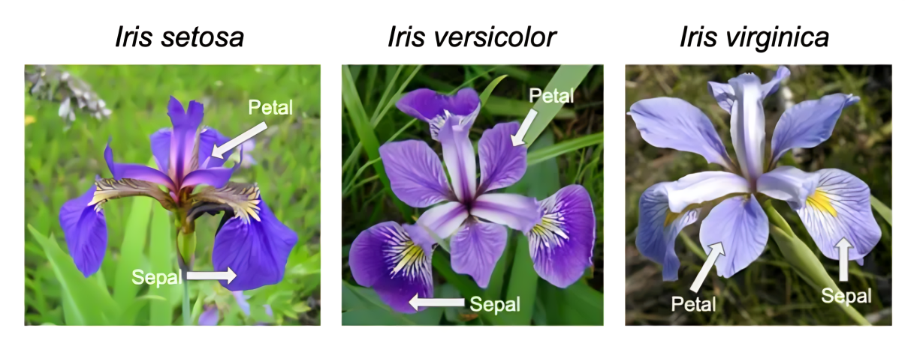

# 🌸 Iris Dataset - EDA & Logistic Regression Classification

### Iris Flower Sample Image

A deep dive into one of the most iconic datasets in machine learning!  
This project explores the **Iris flower dataset** using **Exploratory Data Analysis (EDA)** and builds a **Logistic Regression classifier**, culminating in an elegant **decision boundary** visualization.

>  *If you're new to machine learning, this notebook gives you an insightful and visual introduction to data patterns, class separability, and binary classification in just a few lines of code.*

---

## ✨ Key Highlights

- Rich visual EDA (histograms, violin plots, correlation heatmaps, etc.)
- Trained **Logistic Regression** model to classify *Setosa vs Others*
- Clean, beginner-friendly Python & Jupyter code

---

## 🔍 Insights & Observations

 *Setosa* flowers are **clearly linearly separable** from the rest, especially when plotting:
- **PetalLength, PetalWidth**: A striking distinction appears!
- **SepalWidth** shows outlier and less discriminative power.
- **Violin and boxplots** reveal Setosa's tight feature distribution.

Logistic regression performed **exceptionally well** in separating Setosa due to its linear separability.

---

## 🖼️ Visualizations

### 1. Heatmap of Correlations

### 2. Pair Plot of Features

### 3. Box Plots

### 4. Violin Plots

### 5. Logistic Regression Result

---

